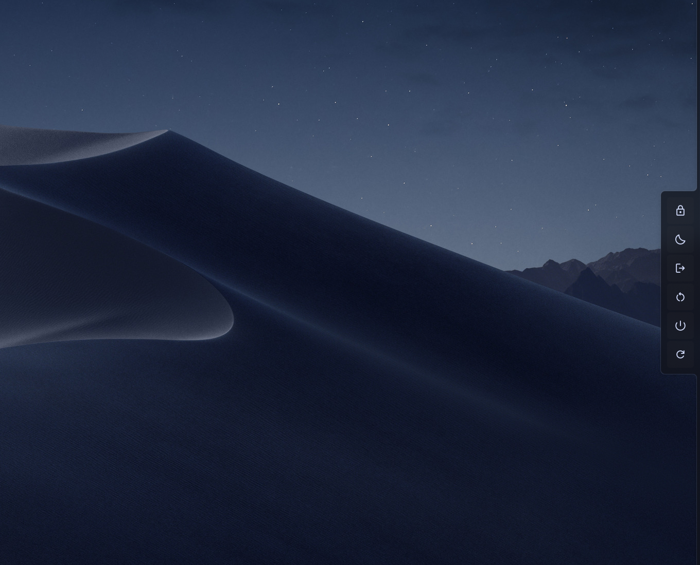

# SessionEdge

[English](README.md) · [Deutsch](README.de.md) · [Español](README.es.md) · [Français](README.fr.md) · [Italiano](README.it.md) · [Português](README.pt.md) · [Русский](README.ru.md) · [日本語](README.ja.md) · **简体中文**

一个 [DankMaterialShell](https://github.com/AvengeMedia/DankMaterialShell) 插件，把会话操作放在屏幕边缘的一条细长会话栏里。把指针移到边缘，会话栏就从框架中滑出。把指针移开，它就滑回去。



带图片的分步说明：[安装与设置指南](docs/GUIDE.zh_CN.md)。

## 功能

会话栏包含锁定、挂起、休眠、注销、重启、关机和重启外壳。每个按钮都可以在设置中隐藏。

它是一个普通的 DMS 弹窗。DMS 框架处于连接模式时，它会从框架中出来，并使用框架的轮廓和背景。没有框架时，它作为普通弹窗打开。

它可以放在任意边缘，也可以放在 DMS 状态栏所在的一侧，并对齐到该边缘的开头、居中或末尾。边缘只有一小段会响应指针，打开前还有一点延迟，所以指针只是经过时它不会打开。

挂起、休眠、注销、重启和关机需要点击并按住，按住时间与 DMS 电源菜单相同。锁定和重启外壳单击即可执行。所有操作都通过 DMS 的会话服务执行，和电源菜单的做法一样。

## 要求

DankMaterialShell 1.6.1 或更高版本。它应该能在 DMS 支持的所有合成器上运行。我自己在 niri 上使用。

## 安装

从插件注册表安装：

```sh
dms plugins install sessionEdge
dms ipc call plugins enable sessionEdge
```

也可以在 DMS 的 设置 → 插件 → 浏览 中找到它。若要从仓库安装：

```sh
git clone https://github.com/satoshoe-dev/dms-sessionedge ~/.config/DankMaterialShell/plugins/SessionEdge
dms ipc call plugins enable sessionEdge
```

## 设置

设置 → 插件 → SessionEdge

| 设置项 | 默认值 |
|---|---|
| 边缘 | 右侧 |
| 在边缘上的位置 / 距开头或末尾的偏移 | 居中 / 0 px |
| 空闲时的细条宽度 | 8 px |
| 感应区长度 | 220 px |
| 按钮大小 | 52 px |
| 打开延迟 / 关闭延迟 | 180 / 500 ms |
| 显示的操作 | 除休眠外全部 |

## IPC

```sh
dms ipc call sessionEdge toggle
```

这条命令会打开或关闭会话栏，例如在 niri 中通过快捷键调用：

```kdl
Mod+Escape { spawn "dms" "ipc" "call" "sessionEdge" "toggle"; }
```

## 翻译

设置页面提供德语、西班牙语、法语、意大利语、葡萄牙语、俄语、日语和简体中文版本，并跟随 DMS 中设置的语言。如果哪里翻译得不对，欢迎提交 pull request。

## 说明

我在 Claude (Anthropic) 的帮助下编写了这个插件，并在自己的 niri 桌面上测试了每一处改动。

## 许可证

MIT
