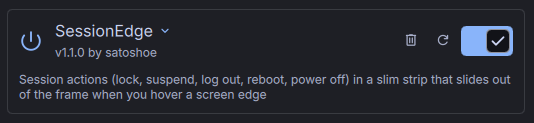
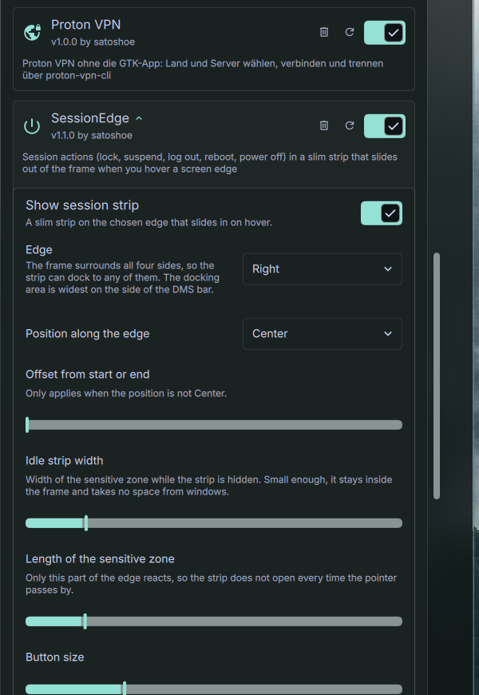
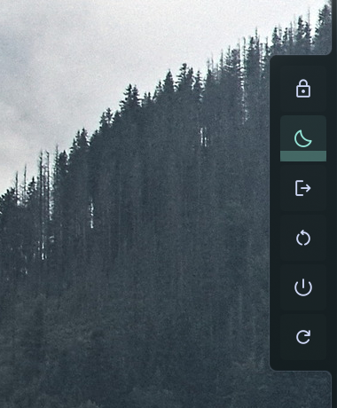

# SessionEdge: paso a paso

[English](GUIDE.md) · [Deutsch](GUIDE.de.md) · **Español** · [Français](GUIDE.fr.md) · [Italiano](GUIDE.it.md) · [Português](GUIDE.pt.md) · [Русский](GUIDE.ru.md) · [日本語](GUIDE.ja.md) · [简体中文](GUIDE.zh_CN.md)

## 1. Instala el complemento

Clona el repositorio en tu carpeta de complementos de DMS:

```sh
git clone https://github.com/satoshoe-dev/dms-sessionedge ~/.config/DankMaterialShell/plugins/SessionEdge
```

## 2. Actívalo

Abre Ajustes → Complementos. SessionEdge aparece en la lista. Actívalo.



Si no aparece, haz clic en «Escanear» en esa página o reinicia el shell con `dms restart`.

## 3. Elige un borde

Despliega SessionEdge en la lista de complementos para ver sus ajustes. Elige el borde en el que debe estar la franja y su posición en ese borde.



Con el marco de DMS en modo conectado, la franja sale deslizándose del marco. En el lado de tu barra la zona de acoplamiento es más ancha.

## 4. Abre la franja

Mueve el puntero al borde elegido y déjalo ahí un momento. La franja se despliega.


Solo reacciona un tramo corto del borde (220 px por defecto), así la franja no se abre cuando el puntero solo pasa por ahí. Ajusta «Longitud de la zona sensible» y «Retraso al abrir» si se abre con demasiada facilidad o demasiado tarde.

## 5. Usa una acción

Bloquear y «Reiniciar el shell» se ejecutan con un clic. Suspender, hibernar, cerrar sesión, reiniciar y apagar requieren hacer clic y mantener pulsado. El botón se llena mientras lo mantienes.



Suelta antes para cancelar.

## 6. Elige los botones

Desactiva al final de los ajustes las acciones que no necesites. Hibernar solo aparece si tu sistema lo admite.

## 7. Ábrela con un atajo de teclado (opcional)

```sh
dms ipc call sessionEdge toggle
```

En niri, añade a tu configuración:

```kdl
binds {
    Mod+Escape { spawn "dms" "ipc" "call" "sessionEdge" "toggle"; }
}
```
